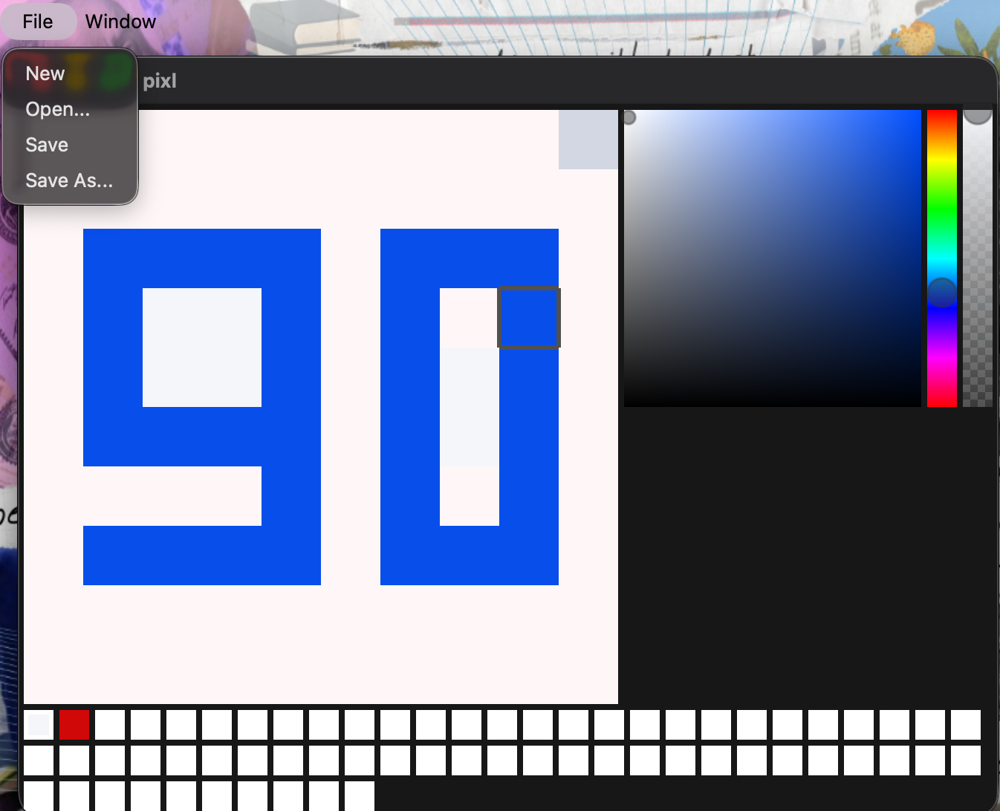

# Pixl

A lightweight pixel art editor built with Go and the [Fyne](https://fyne.io/) GUI framework. Draw, color, and export pixel art directly from your desktop.



---

## Features

### Canvas
- Grid-based drawing area with configurable dimensions (rows and columns)
- Zoom in/out via scroll wheel (adjusts pixel size)
- Pan the canvas by right-click dragging
- Visual cursor preview that highlights the target pixel before you paint

### Drawing
- Pixel brush tool — left-click to paint individual pixels
- Real-time canvas updates as you draw

### Color Management
- HSV color picker for precise color selection
- Swatch palette supporting up to 64 colors
- Click a swatch to select it; the color picker updates it live
- Selected swatch is highlighted with a white border

### File Operations
- **New** — create a blank canvas with a custom width and height
- **Open** — load an existing PNG image onto the canvas
- **Save** — save your work back to the original file
- **Save As** — export to a new PNG file path

---

## Getting Started

### Prerequisites

- Go 1.20+
- A C compiler (required by Fyne — see [Fyne Getting Started](https://docs.fyne.io/started/))

### Install & Run

```bash
git clone https://github.com/thaisc98/pixl.git
cd pixl
go run .
```

### Build

```bash
go build -o pixl .
./pixl
```

---

## Tech Stack

- **[Go](https://go.dev/)** — core language
- **[Fyne v2](https://fyne.io/)** — cross-platform GUI framework
- **[lusingander/colorpicker](https://github.com/lusingander/colorpicker)** — HSV color picker widget
- **Go standard library** — `image` and `image/png` for file I/O

---

## License

MIT